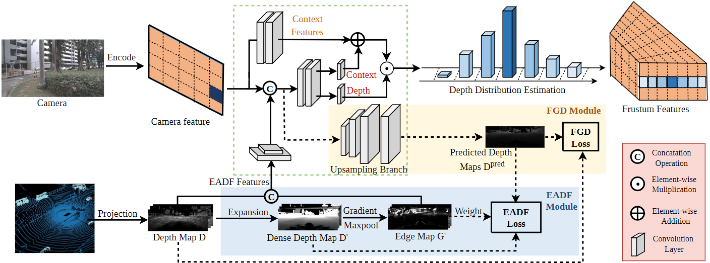
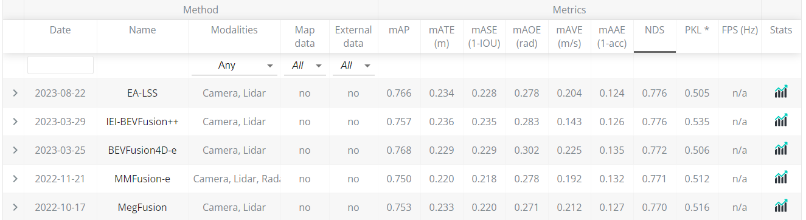

[](https://paperswithcode.com/sota/3d-object-detection-on-nuscenes?p=ea-bev-edge-aware-bird-s-eye-view-projector)

# EA-LSS: Edge-aware Lift-splat-shot Framework for 3D BEV Object Detection
 

### [leaderboard](https://www.nuscenes.org/object-detection) | [paper](https://arxiv.org/abs/2303.17895)

## Citation
```bibtex
@article{hu2023ealss,
  title={EA-LSS: Edge-aware Lift-splat-shot Framework for 3D BEV Object Detection},
  author={Haotian Hu and Fanyi Wang and Jingwen Su and Laifeng Hu and Weiye Fang and Jingwei Xu and Zhiwang Zhang},
  journal={arXiv preprint arXiv:2303.17895},
  year={2023}
}
```

## News
+ **2023.8.22**   EA-LSS achieved the first place in the nuScenes 3D object detection leaderboard！
+ **2023.8.16**   create README.md
 

## Abstract
In recent years, great progress has been made in the Lift-Splat-Shot-based (LSS-based) 3D object detection method. However, inaccurate depth estimation remains an important constraint to the accuracy of camera-only and multi-modal 3D object detection models, especially in regions where the depth changes significantly (i.e., the ''depth jump'' problem). In this paper, we proposed a novel Edge-aware Lift-splat-shot (EA-LSS) framework. Specifically, edge-aware depth fusion (EADF) module is proposed to alleviate the ''depth jump'' problem and fine-grained depth (FGD) module to further enforce refined supervision on depth. Our EA-LSS framework is compatible for any LSS-based 3D object detection models, and effectively boosts their performances with negligible increment of inference time. Experiments on nuScenes benchmarks demonstrate that EA-LSS is effective in either camera-only or multi-modal models. It is worth mentioning that EA-LSS achieved the state-of-the-art performance on nuScenes test benchmarks with mAP and NDS of 76.6% and 77.6%, respectively.
 
## Main Result
### nuScenes detection test
| Method                                                                   | mAP        | NDS        |
| ------------------------------------------------------------------------- | ---------- | ---------- |
| BEVFusion(Peking University)    |  71.3       | 73.3       |
| [**+EA-LSS**](configs/EABEV/eabev_tf_4x8_10e_nusc_aug.py)     | **72.2**     | **74.4**    |
| **+EA-LSS***     | **76.6**     | **77.6**    |

*reprsent the test time augment and model ensemble.

### nuScenes detection validation
| Method                                                                    | mAP        | NDS        |  Latency(ms) |
| ------------------------------------------------------------------------- | ---------- | ---------- |--------------|
| BEVDepth-R50    |  33.0       | 43.6       | 110.3 |
|  **+EA-LSS**   | **33.4**       | **44.1**   | 110.3 |
| Tig-bev    |  33.8       | 37.5       | 68.0 |
|  **+EA-LSS**   | **35.9**       | **40.7**   | 68.0 |
| BEVFusion(MIT)    |  68.5       | 71.4       | 119.2 |
|  **+EA-LSS**    | **69.4**       | **71.8**   | 123.6 |
| BEVFusion(Peking University)    |  69.6       | 72.1       | 190.3 |
|  [ **+EA-LSS**  ](configs/EABEV/eabev_tf_4x8_10e_nusc_aug.py)     | **71.2**      | **73.1**    | 194.9|


### Visualization results
#### nuScenes 3D object detection


## Acknowlegement
We sincerely thank the authors of [BEVFusion(Peking University)](https://github.com/ADLab-AutoDrive/BEVFusion), [BEVFusion(MIT)](https://github.com/mit-han-lab/bevfusion), [mmdetection3d](https://github.com/open-mmlab/mmdetection3d), [TransFusion](https://github.com/XuyangBai/TransFusion) for open sourcing their methods.
